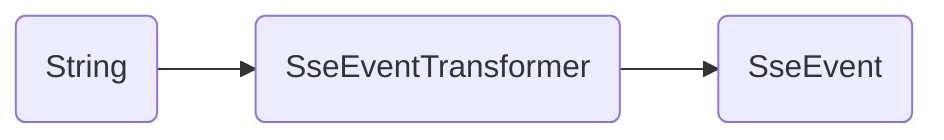

# SSE Client

An SSE event transformer and client for Dart applications.

Use an event transformer to convert raw String responses into SSE-spec events or use the provided lightweight client to open an SSE event stream without the hassle.

The transformer and client are provided as simple classes to support easier mocking and testing of your application logic.

## Features

This package is split into two exports to reduce redundant dependencies. Specifically, if you want your own client implementation, there's no use in forcing you to use this one or depend on the `http` package.

The two exports are `core` and `client`:

```
├── src
│   ├── core
│   │   ├── sse_event.dart
│   │   └── sse_event_transformer.dart
│   └── client
│       └── sse_client.dart
├── sse_core.dart
└── sse_client.dart
```

### Core

The `core` export includes an `SseEvent` model and an `SseEventTransformer` that can be used to transform a `Stream<String>` into a `Stream<SseEvent>`.

**SseEvent**

```dart
class SseEvent {
    /// The event ID.
  final String? id;

  /// The event type.
  final String? event;

  /// The event data.
  final String data;

  /// The retry time in milliseconds (optional).
  final int? retry;

  /// Creates a new [SseEvent].
  /// [id] The event ID.
  /// [event] The event type.
  /// [data] The event data.
  /// [retry] The retry time in milliseconds (optional).
  SseEvent({this.id, this.event, required this.data, this.retry});
}
```

**SseEventTransformer**



### Client

The `client` export includes everything in `core` plus a lightweight `SseClient` that can be used to connect to an SSE stream and receive `Stream<SseEvent>` while supporting different HTTP methods, headers, and body parameters.

```dart
Stream<SseEvent> connect(
    Uri uri, {
    String method = 'GET',
    Map<String, String>? headers,
    Object? body,
  }) ...
```

**Note:** If the `[body]` is supplied but is not a `Map` or a `List`, it will be converted to a `String`.

## Getting started

Add this package to your app's dependencies.

```bash
dart/flutter pub add sse_client
```

## Usage

### SseEventTransformer

You can use the core `SseEventTransformer` to convert a stream of String responses into `SseEvent` models in a custom client implementation:

```dart
import 'package:sse_client/sse_core.dart';

final stream = response
    .stream
    .transform(const LineSplitter())
    .transform(const SseEventTransformer());
```

**Note:** Be sure to use the `LineSplitter` before the `SseEventTransformer`.

### SseClient

If you don't want to implement your own client logic, use the `SseClient` directly:

```dart
import 'package:sse_client/sse_client.dart';

final client = SseClient();
final events = client.connect(Uri.parse('https://sse.dev/test'));
```