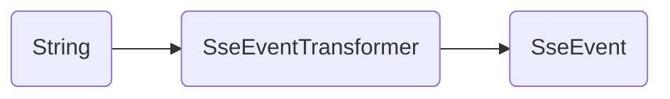

# Simple SSE

An SSE event transformer for simplified SSE client implementations

## What is SSE?

Server-Sent Events (SSE) is a web protocol for pushing data from a server to a client (it is unidirectional) via HTTP without requiring the client to continuously poll for new data.

Data is transmitted using a series of strings containing a key and a value, separated by a colon. The acceptable keys are:

  * `id`: the id of the event - used for retrying if the connection is lost
  * `event`: a type or category for the data
  * `data`: the content of the message - this may contain multiple lines
  * `retry`: a millisecond value used for retrying the connection if disconnected

Lines starting with a colon are comments and are ignored.

See the [whatwg.org](https://html.spec.whatwg.org/multipage/server-sent-events.html#processField) specification.

## What is Simple SSE?

This package aims to simplify the client-side of SSE by constructing a consumable `SseEvent` model (see below) from the event stream while complying with the specifications.

## Features

**SseEvent**

```dart
class SseEvent {
    /// The event ID.
  final String? id;

  /// The event type.
  final String? event;

  /// The event data.
  final String data;

  /// The retry time in milliseconds (optional).
  final int? retry;

  /// Creates a new [SseEvent].
  /// [id] The event ID.
  /// [event] The event type.
  /// [data] The event data.
  /// [retry] The retry time in milliseconds (optional).
  SseEvent({this.id, this.event, required this.data, this.retry});
}
```

**SseEventTransformer**



## Getting started

Add this package to your app's dependencies.

```bash
dart/flutter pub add simple_sse
```

## Usage

```dart
import 'package:simple_sse/sse_core.dart';

final stream = response
    .stream
    .transform(const LineSplitter())
    .transform(const SseEventTransformer());
```

**Note:** Be sure to use the `LineSplitter` before the `SseEventTransformer`.
